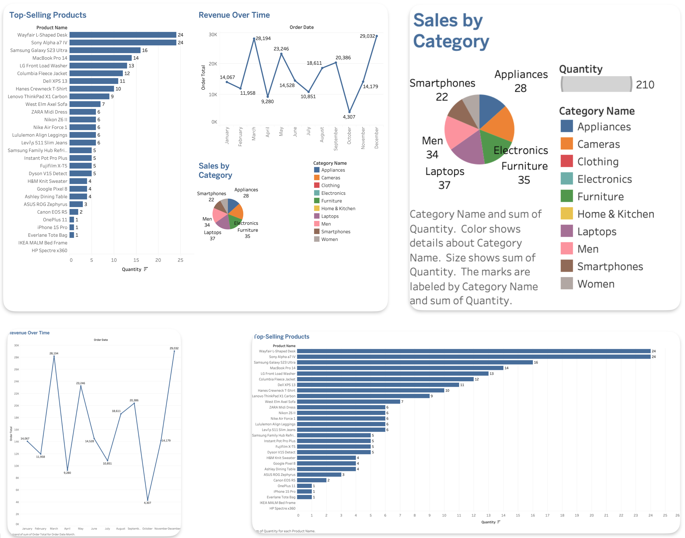
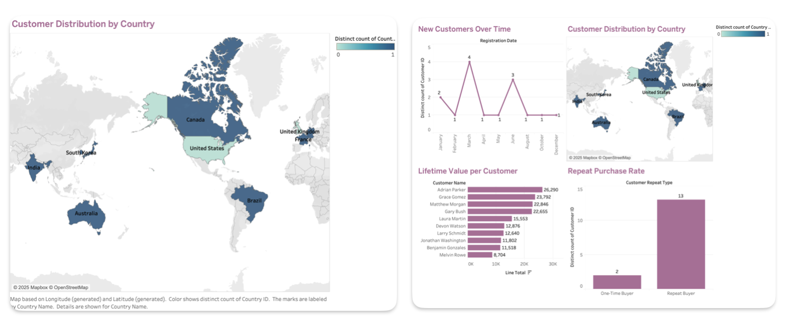
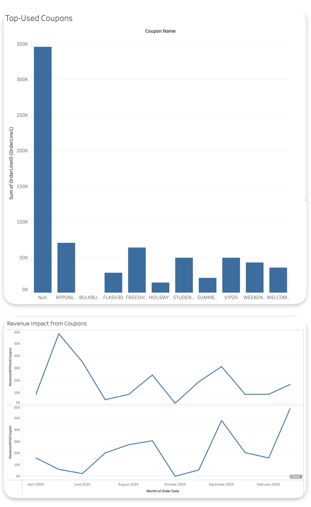
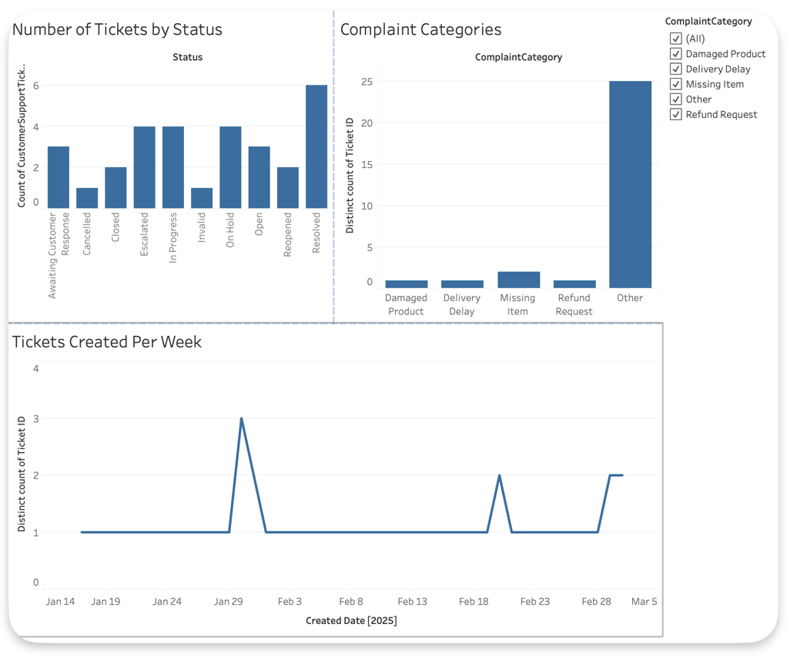
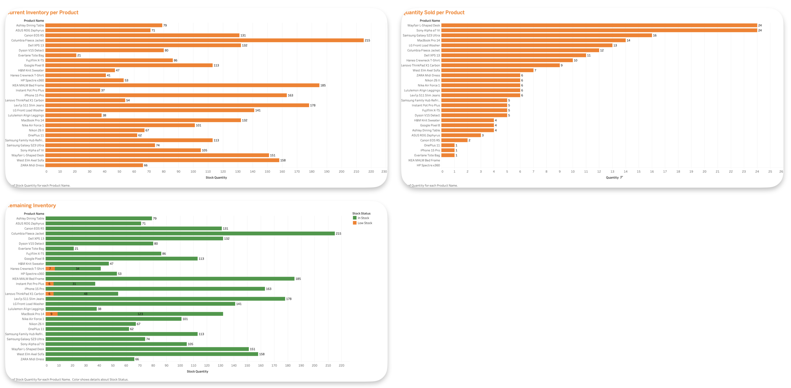
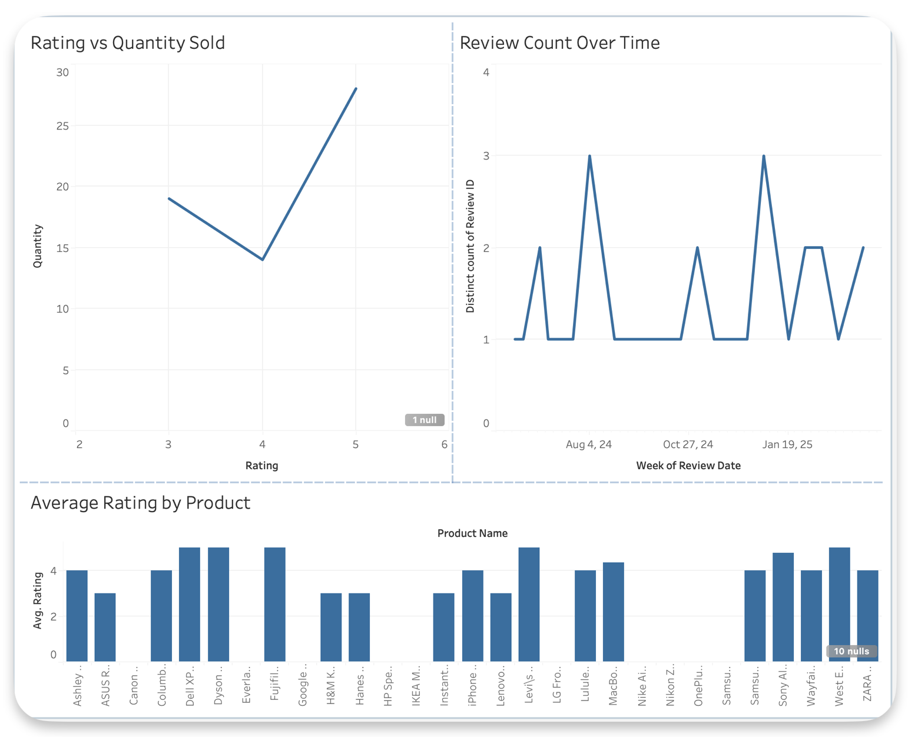
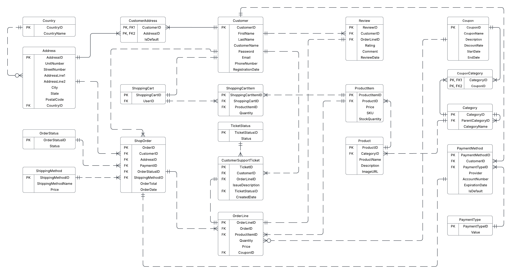

# E-Commerce-Database-Management-System

## Overview

**Target 2.0** redefines the online retail experience with a comprehensive backend system that manages **customers**, **orders**, **products**, **coupons**, and **logistics**—all in real time. Built for scalability, security, and performance, this system powers efficient digital retail operations and enhances customer trust and satisfaction.

## Key Features

- **Customer & Address Management**  
  Manage profiles, multiple shipping addresses, and secure payment methods.
  
- **Product & Inventory Management**  
  Support product variants, stock tracking, categories, subcategories, and dynamic pricing.

- **Order & Cart Lifecycle**  
  Enable seamless shopping cart experiences, checkout flows, and real-time order tracking.

- **Coupons & Promotions**  
  Associate discounts with specific products or categories for targeted campaigns.

- **Customer Support & Feedback**  
  Ticketing system, order-based reviews, and automated status updates.

- **Security & Data Integrity**  
  Includes password hashing, encrypted sensitive fields, validation constraints, and audit-ready history.

## Data Visualizations

Interactive dashboards and reports built in **Tableau** provide insights into:

- **Sales Dashboard** – Visualize revenue, growth trends, and seasonal spikes

  

- **Customer Insights** – Understand customer behavior, lifetime value, and retention

  

- **Coupon Discount Impact** – Analyze the effectiveness of discounts and marketing campaigns

  

- **Customer Support Dashboard** – Monitor ticket resolution, volume, and performance

  

- **Inventory Dashboard** – Track low stock, stockouts, and product movement

  

- **Product Rating Dashboard** – Aggregate review metrics to improve offerings

  

## Architecture

- **Backend**: SQL Server  
- **Schema**: 20 normalized, constraint-enforced tables  
- **Security**: Symmetric encryption for PII and payment info  
- **Stored Logic**: Views, triggers, stored procedures  
- **Computed Columns**: Dynamic fields like total stock, formatted addresses  
- **Visualization**: Tableau dashboards  

## Technical Highlights

| File Name                        | Purpose                                                      |
| -------------------------------- | ------------------------------------------------------------ |
| `DDL.sql`                        | Builds the entire database schema, including tables and constraints |
| `DML.sql`                        | Seeds the database with sample data                          |
| `ComputedColumn.sql`             | Defines functions like `GetCustomerFullName()` and `GetOrderGrandTotal()` |
| `ColumnDataEncryption.sql`       | Implements column-level encryption for sensitive fields      |
| `StoredProcedures.sql`           | Encapsulates business logic for orders, payments, stock updates, etc. |
| `Trigger.sql`                    | Automates updates to order totals and stock levels           |
| `Views.sql`                      | Creates simplified query interfaces for frequent reporting use |
| `TableLevelCheckConstraints.sql` | Adds validation functions like `IsValidEmail()` and `IsValidPhoneNumber()` |

## E-R Diagram

The system includes a comprehensive ERD showing all 20 entities and their relationships:

## Future Enhancements

- AI-driven product recommendations
- Multi-language & multi-currency support
- GraphQL/REST API layer
- Integration with logistics providers

## Conclusion

Target 2.0 is more than a database—it's a **data-driven engine for digital retail success**. With robust architecture, intuitive visuals, and secure processes, it sets the foundation for innovation in modern e-commerce platforms.

